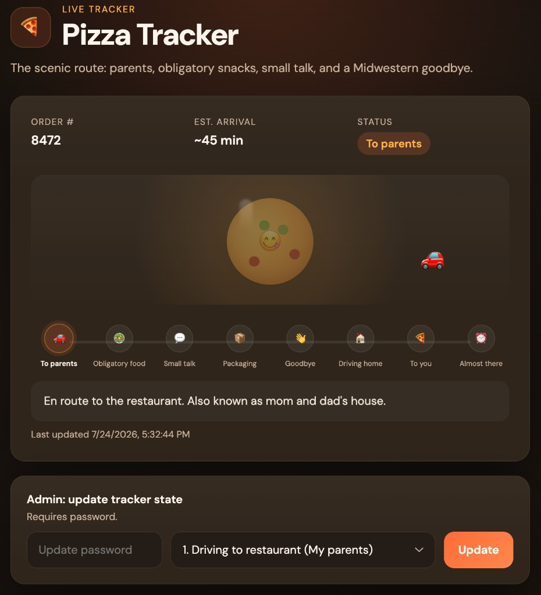

# Pizza Tracker

A playful mock pizza delivery tracker for the scenic route: parents' house, obligatory snacks, small talk, a Midwestern goodbye, and finally your door.

Share the link with friends and update the status as you go. Link previews in Slack, iMessage, and elsewhere show the current state with a generated OG image.



## Features

- Live tracker UI with animated progress and delivery scene
- Eight predefined states from "driving to parents" through "arriving any minute"
- Password-protected admin controls to update the current state
- Open Graph / Twitter card previews with dynamically generated images
- Single shared state stored in Supabase (everyone sees the same status)

## Tech stack

- **Backend:** Node.js, Express
- **Database:** Supabase (Postgres)
- **Frontend:** Vanilla HTML/CSS/JS
- **Image generation:** Sharp (SVG → PNG for OG previews)

## Prerequisites

- Node.js (with [pnpm](https://pnpm.io/) 11+)
- A [Supabase](https://supabase.com/) project

## Setup

1. **Install dependencies**

   ```bash
   pnpm install
   ```

2. **Configure environment**

   Copy `example.env` to `.env` and fill in your values:

   ```bash
   cp example.env .env
   ```

   | Variable | Description |
   | --- | --- |
   | `SUPABASE_URL` | Your Supabase project URL |
   | `SUPABASE_SECRET_KEY` | Service role / secret key (server-side only) |
   | `UPDATE_PASSWORD` | Password required to change tracker state |
   | `PUBLIC_URL` | Public URL for link previews (e.g. `https://your-app.onrender.com`) |
   | `DIRECT_URL` | Postgres connection string for migrations (`db:setup`) |

3. **Create the database table**

   Run the schema in the Supabase SQL editor, or from the command line:

   ```bash
   pnpm db:setup
   ```

   This creates the `tracker_state` table and seeds the initial state.

4. **Start the server**

   ```bash
   pnpm dev    # development with auto-reload
   pnpm start  # production
   ```

   Open [http://localhost:3000](http://localhost:3000).

## Tracker states

| State | Short label | ETA |
| --- | --- | --- |
| Driving to restaurant (parents) | To parents | ~45 min |
| Eating obligatory food | Obligatory food | ~35 min |
| Making small talk | Small talk | ~28 min |
| Packaging food | Packaging | ~20 min |
| Midwestern goodbye | Goodbye | ~15 min |
| Driving home | Driving home | ~10 min |
| Driving to your place | To you | ~5 min |
| Arriving any minute now | Almost there | Any minute |

States can also be referenced by aliases in the API (e.g. `parents`, `goodbye`, `soon`). See `lib/states.js` for the full list.

## API

| Method | Path | Auth | Description |
| --- | --- | --- | --- |
| `GET` | `/api/config` | — | List all tracker states |
| `GET` | `/api/state` | — | Get current tracker state |
| `PUT` | `/api/state` | Password | Update tracker state |

**Update request body:**

```json
{
  "stateId": "driving-home",
  "password": "your-update-password"
}
```

## Deployment

The app is a single Node process. Set all required environment variables on your host.

- Set `PUBLIC_URL` to your production URL so link previews resolve correctly. On [Render](https://render.com/), `RENDER_EXTERNAL_URL` is used automatically if `PUBLIC_URL` is not set.
- Use the Supabase **transaction pooler** (`DATABASE_URL`, port 6543) for app connections and the **session pooler** (`DIRECT_URL`, port 5432) for `pnpm db:setup`.

## Project structure

```
├── server.js           # Express app and API routes
├── lib/
│   ├── states.js       # Tracker state definitions and aliases
│   ├── tracker.js      # Read/write state via Supabase
│   ├── share.js        # OG meta tags and preview image generation
│   └── auth.js         # Password verification
├── public/             # Static frontend assets
└── supabase/
    └── schema.sql      # Database schema
```
